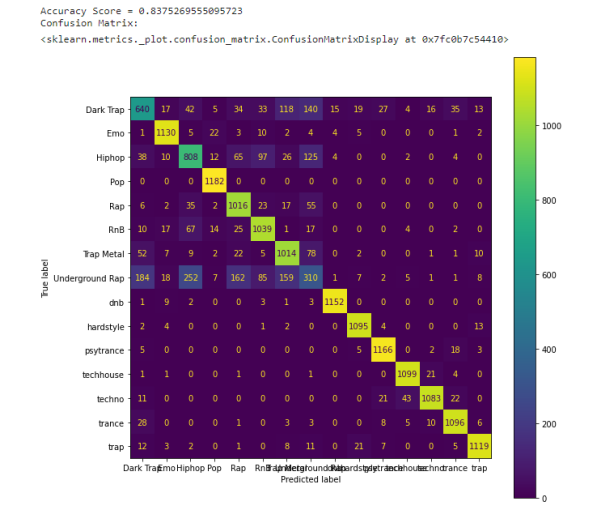
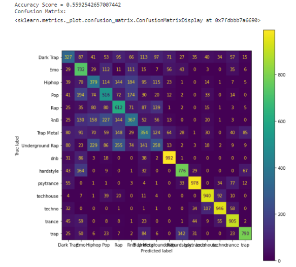

# Spotify-Classification

## Overview
1. Classify the 35,877 pieces of music on the Spotify.
2. Dataset can be download here: ：https://www.kaggle.com/datasets/mrmorj/dataset-of-songs-in-spotify
3. Our paper here: 

## Detail
1. We identify the range and significance of each audio feature, while also observing for any missing values or noise.
2. We implement data preprocessing, including data cleaning, feature normalization, addressing imbalance problems.
3. Performing Random Forest Algorithm, and the accuracy is 0.83.

4. Performing Support Vector Machine, and the accuracy is 0.55.

5. According to the feature importance of Linear SVM, select the top-N important features to perform clustering using algorithms such as K-means clustering, Hierarchical clustering, DBSCAN, GMM, and Birch.
